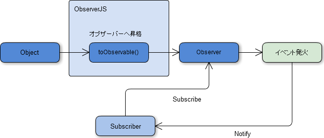

# ObserverJS
javascript generic object observer.  
  

  
  
# How to  
  
    

    // SomeObject.
    var Object = {...};

    // YourReceiver.
    var YourReceiver = {...};

    
    // Promotion to Observer.
    Observable.toObservable(SomeObject);
    

    // subscribe.
    SomeObject.subscribe(YourReceiver.YourFunc, 'SomeObjectEventFunc');
    
    
	// Ignition!.
    SomeObject.SomeObjectEventFunc();

